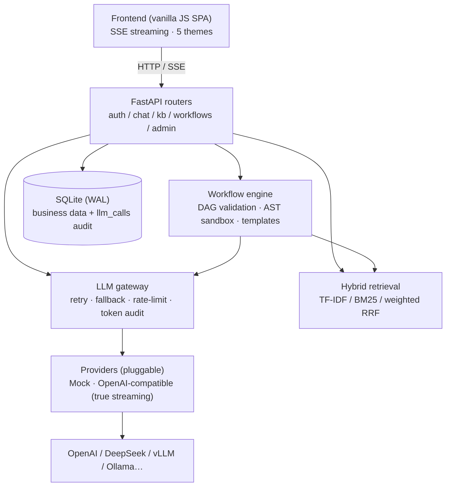

<div align="center">

# Sinan 司南

**Enterprise AI platform for cross-border e-commerce** — role-based AI assistants · knowledge-base RAG · LLM gateway · workflow engine

[](https://github.com/lianghui32/sinan-ai-platform/actions/workflows/ci.yml)


Streaming chat · Hybrid retrieval (TF-IDF / BM25 / weighted RRF) · Retry / Fallback / Rate-limit / Token audit · AST-sandboxed DAG engine

[简体中文](README.md) | English


</div>

---

Sinan (司南) is the earliest pointing instrument in Chinese history — the ancestor of the compass. The platform does the same for enterprise teams: point every role to the right answer, grounded in the company's own knowledge and workflows.

## ✨ Highlights

- 💬 **SSE streaming chat** — token-by-token output, citation sources delivered with the reply; automatic fallback to a local mock on model failure, **explicitly marked** in the UI instead of silently faking answers
- 🔎 **Hybrid retrieval RAG** — pluggable modes: TF-IDF / BM25 / weighted Reciprocal Rank Fusion; automatic chunking; **retrieval quality measured on a golden set** ([eval/report.md](eval/report.md)) and guarded in CI
- 🛡️ **LLM gateway** — every model call funnels through one layer: exponential-backoff retry, fallback chain, per-user sliding-window rate limiting (429 + Retry-After), token accounting & call auditing
- ⚙️ **JSON-DAG workflow engine** — extensible node types (llm / http_api / code / condition / knowledge_search…); definitions validated at save time; `code` nodes sandboxed by an **AST whitelist**; per-node input/output/latency audited
- 🧭 **Multi-tenancy & permissions** — employee accounts (pbkdf2), department-based assistant visibility, strict per-user data isolation
- 🎨 **5 UI themes** — CSS-variable architecture; adding a theme is one variable block
- 🧪 **Engineering quality** — 107 pytest tests green (incl. retrieval-eval guard & security hardening), Docker / docker-compose / GitHub Actions CI, pinned dependencies
- 🔐 **Security hardening** — centralized access checks, API-key encryption at rest, streaming upload limits, internal-call secrets

## 🚀 Quick start

```bash
git clone https://github.com/lianghui32/sinan-ai-platform.git
cd sinan-ai-platform
pip install -r requirements.txt
python -m uvicorn app.main:app --host 0.0.0.0 --port 8005
```

Open <http://127.0.0.1:8005> — default accounts `admin / admin123` (admin) and `emp001 / emp123` (employee). The database is seeded on first run so RAG and workflows work out of the box.

Or with Docker: `docker compose up --build`

**Real LLMs**: the built-in mock provider works fully offline. To use a real model, set any OpenAI-compatible endpoint (`OPENAI_BASE_URL` / `OPENAI_API_KEY`, supports OpenAI / DeepSeek / Moonshot / vLLM / Ollama…) and switch the assistant's provider to `openai_compatible` in the admin UI.

## 📊 Retrieval evaluation

"How do you prove your retrieval works?" — with numbers. 30 deterministic synthetic documents + 24 golden queries (`scripts/eval_rag.py`, fully reproducible):

| Mode | hit@1 | hit@3 | MRR |
|---|---|---|---|
| TF-IDF cosine | 50.00% | 66.67% | 0.648 |
| BM25 | 75.00% | 100.00% | 0.875 |
| **Hybrid (weighted RRF 0.3/0.7, default)** | **75.00%** | **100.00%** | **0.875** |

Fusion weights were picked by grid search on the golden set: equal weights (0.5/0.5) let TF-IDF noise dilute top-1 precision (75% → 62.5%). The evaluation also runs in CI as a regression guard. Full report: [eval/report.md](eval/report.md).

## 🏗️ Architecture



## 🗺️ Roadmap

- [ ] Dense retrieval (embeddings, three-way fusion) & reranking
- [ ] Workflow node-level parallelism, scheduling, subflows
- [ ] PostgreSQL support + Redis-backed rate limiting (multi-replica)
- [ ] Enterprise SSO (OAuth2 / LDAP) & fine-grained RBAC
- [ ] Structured logging & Prometheus metrics

## 📄 License

[MIT](LICENSE) · 中文文档见 [README.md](README.md)
