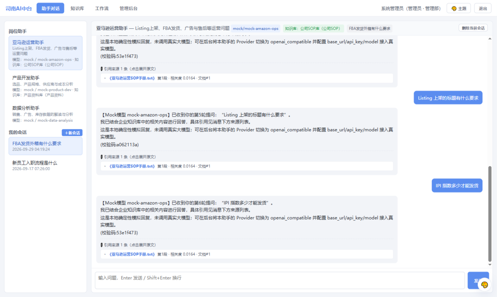
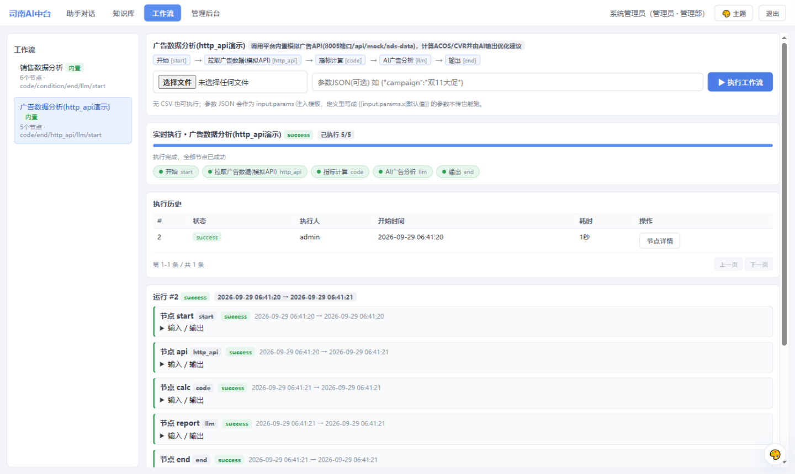
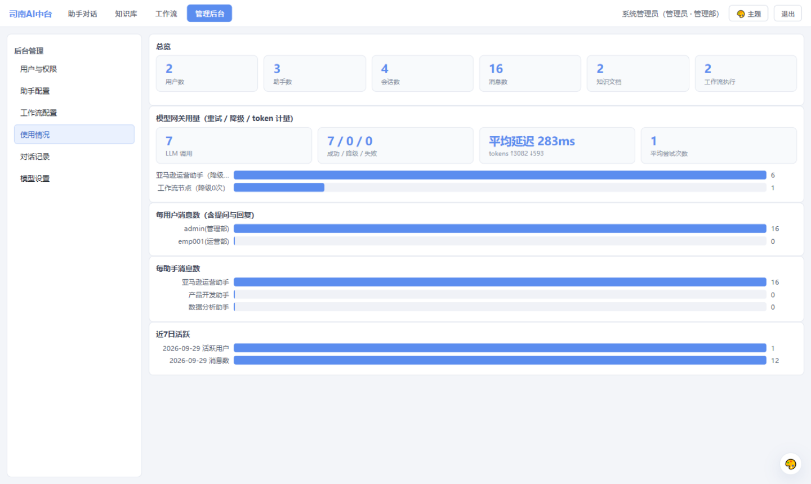
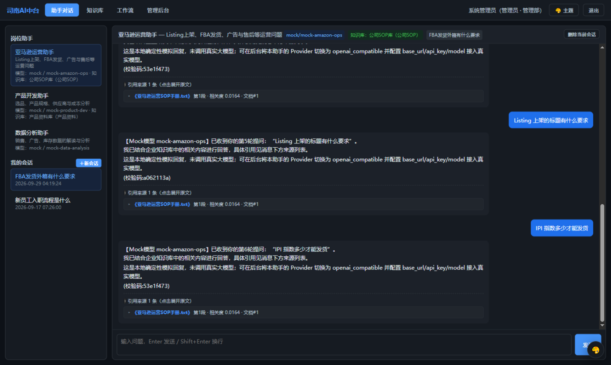
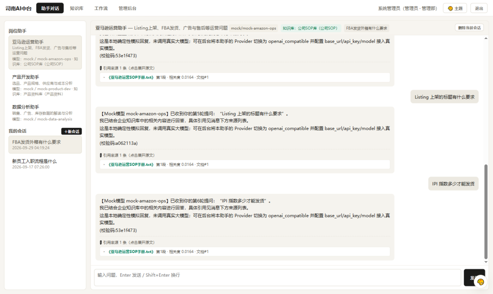
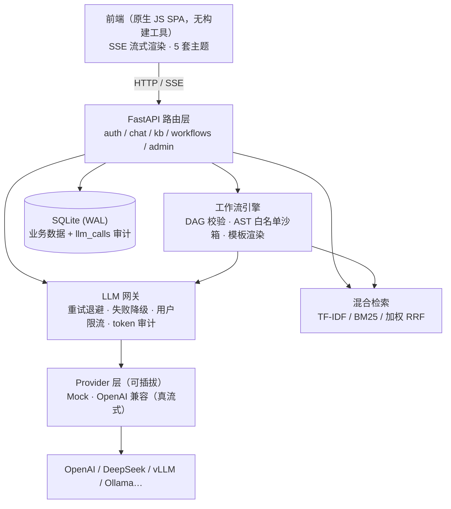

<div align="center">

# 司南 Sinan

**跨境电商企业级 AI 中台** — 岗位助手 · 知识库 RAG · LLM 网关 · 工作流引擎

[](https://github.com/lianghui32/sinan-ai-platform/actions/workflows/ci.yml)


流式对话 · 混合检索（TF-IDF / BM25 / 加权 RRF）· 重试 / 降级 / 限流 / token 审计 · AST 沙箱 DAG 引擎

[简体中文](README.md) | [English](README.en.md)



</div>

---

## 为什么叫"司南"

司南是中国最早的指向仪器（指南针的前身）。这个平台做的事，是让企业里每个岗位的员工都能问对方向：运营问 SOP、产品问规格、数据问结论——它是指向企业知识与企业流程的那根"针"。

## ✨ 核心特性

- 💬 **SSE 流式对话** — 逐字输出、引用来源随回复下发；多轮上下文自动组装；模型不可用时自动降级并在界面上**显式标注**，而不是静默给假回复
- 🔎 **混合检索 RAG** — TF-IDF / BM25 / 加权 RRF 三种模式可切换；文档自动分块（段落聚合 + 滑窗重叠）；**golden set 量化评估**驱动算法与参数选型（见 [eval/report.md](eval/report.md)）
- 🛡️ **LLM 网关** — 所有模型调用收敛到统一入口：指数退避重试、失败降级链、每用户滑动窗口限流（429 + Retry-After）、token 计量与 `llm_calls` 调用审计，后台可视化
- ⚙️ **JSON-DAG 工作流引擎** — 节点类型可扩展（llm / http_api / code / condition / knowledge_search…）；保存期即校验 DAG 与表达式；`code` 节点用 **AST 白名单沙箱**防代码注入；每节点输入/输出/耗时全量审计
- 🧭 **多用户与权限** — 员工账号体系、pbkdf2 口令哈希、部门可见性 + 显式授权、员工数据严格隔离
- 🎨 **5 套主题** — 清爽蓝 / Codex 暖白 / GitHub Dark / Dracula 紫 / Nord 极地，CSS 变量架构，新增主题只需一个变量块
- 🧪 **工程质量** — 107 项 pytest 全绿（含检索效果回归护栏与安全加固专项）、Docker / docker-compose / GitHub Actions CI、依赖版本锁定
- 🔐 **安全加固** — 访问判定统一收敛（修"列表校验、使用处漏校验"的横向越权面）、API Key 静态加密（拖库拿不到明文）、上传分块限量读取、内部调用密钥

## 🖼️ 界面预览

| 工作流实时执行 | 后台用量审计 |
|---|---|
|  |  |

| GitHub Dark 主题 | Codex 暖白主题 |
|---|---|
|  |  |

## 🚀 快速开始

### 本地运行

```bash
git clone https://github.com/lianghui32/sinan-ai-platform.git
cd sinan-ai-platform
pip install -r requirements.txt

python -m uvicorn app.main:app --host 0.0.0.0 --port 8005
```

浏览器打开 <http://127.0.0.1:8005>，默认账号 `admin / admin123`（管理员）、`emp001 / emp123`（演示员工）。
首次启动自动建库并写入种子数据（知识库示例文档、3 个岗位助手、2 个演示工作流），开箱即可体验 RAG 与工作流。

### Docker

```bash
docker compose up --build
```

### 接入真实大模型

平台默认使用内置 Mock Provider（确定性回复，离线可跑）。接真实模型只需两步：

1. 后台「模型设置」填写任意 OpenAI 兼容端点的 Base URL / API Key（或用环境变量 `OPENAI_BASE_URL` / `OPENAI_API_KEY` / `OPENAI_MODEL`），支持 OpenAI / DeepSeek / Moonshot / 通义 / vLLM / Ollama；
2. 后台「助手配置」把目标助手的 Provider 切为 `openai_compatible`。

### 运行测试与评估

```bash
python -m pytest tests -q     # 107 项测试
python scripts/eval_rag.py    # RAG 检索效果评估，生成 eval/report.md
```

## 🏗️ 架构



设计文档见 [项目原理.md](项目原理.md)：模块设计取舍、流式重试的语义边界、混合检索的评估驱动调参过程、以及每一轮"症状 → 根因 → 修复"的完整记录。

## 📊 检索效果评估

"你怎么证明你的检索是有效的？"——用评估回答。30 份确定性合成语料 + 24 条 golden 查询（`scripts/eval_rag.py`，一键复现）：

| 检索模式 | hit@1 | hit@3 | MRR |
|---|---|---|---|
| TF-IDF 余弦 | 50.00% | 66.67% | 0.648 |
| BM25 | 75.00% | 100.00% | 0.875 |
| **混合（加权 RRF 0.3/0.7，默认）** | **75.00%** | **100.00%** | **0.875** |

融合权重不是拍的：golden set 上网格扫描发现等权 0.5/0.5 会被 TF-IDF 的噪声稀释头部精度（hit@1 75% → 62.5%），0.3/0.7 与最优单路持平且保留第二路兜底。评估脚本同时纳入 CI 作为回归护栏——改检索算法导致指标回退会直接挂测试。完整报告与局限声明见 [eval/report.md](eval/report.md)。

## 📁 目录结构

```
sinan-ai-platform/
├── app/
│   ├── main.py               # create_app 工厂 + 限流器接线
│   ├── llm_gateway.py        # LLM 网关：重试/降级/限流/token计量/审计
│   ├── providers.py          # Provider 抽象：Mock / OpenAI 兼容（真流式）
│   ├── knowledge.py          # 分块 + TF-IDF/BM25/加权 RRF 混合检索
│   ├── workflows.py          # DAG 校验/模板渲染/执行器
│   ├── safe_eval.py          # code 节点 AST 白名单求值器
│   ├── db.py                 # SQLite(WAL) + 审计表
│   └── routers/              # auth/chat/kb/workflows/admin/integrations/mock
├── static/                   # 前端（原生 JS/CSS，CSS 变量多主题，SSE 解析）
├── tests/                    # 107 项 pytest（含安全加固专项）
├── scripts/eval_rag.py       # RAG 检索效果评估（可复现）
├── eval/report.md            # 评估报告
├── docs/screenshots/         # 界面截图
├── Dockerfile / docker-compose.yml
└── .github/workflows/ci.yml  # CI：测试 + 评估回归
```

## 🗺️ Roadmap

- [ ] 语义向量检索（embedding 三路融合）与 rerank
- [ ] 工作流节点级并行、定时触发、子流程
- [ ] PostgreSQL 适配 + Redis 限流（多副本部署）
- [ ] 企业 SSO（OAuth2 / LDAP）与细粒度 RBAC
- [ ] 结构化日志与 Prometheus 指标

架构上已为以上每一项留好扩展点，欢迎按兴趣认领。

## 🤝 贡献

Issue / PR 均欢迎。提交前请确保 `python -m pytest tests -q` 全绿；涉及检索算法的改动请附带 `scripts/eval_rag.py` 的前后指标对比。详见 [CONTRIBUTING.md](CONTRIBUTING.md)。

## ⚠️ 安全说明

- 默认口令 `admin / admin123` 仅供本地演示，**任何对外部署前请先修改**并配置 HTTPS；
- 平台定位为单机内部工具：横向扩容需将限流计数外置（Redis）并迁移数据库（见 Roadmap）。

## 📄 License

[MIT](LICENSE)
